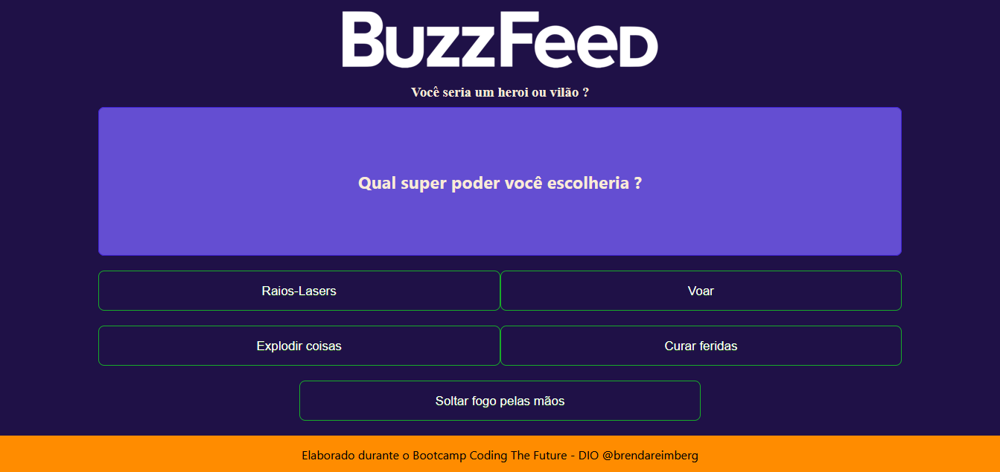
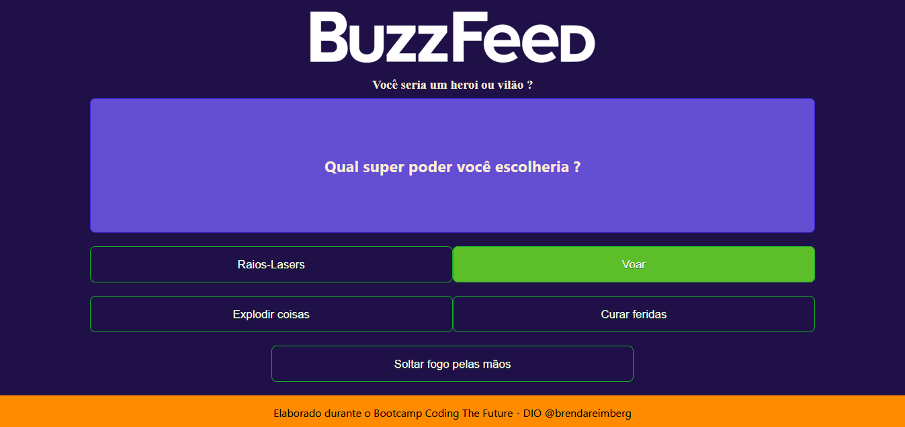
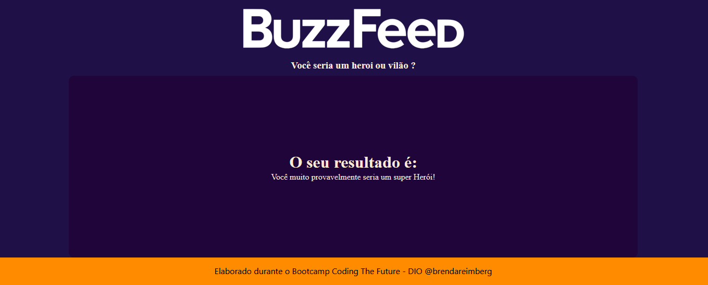

# Módulo Fundamentos do Angular Framework 

## Aula: Criando um Clone do BuzzFeed com Angular

### Conteúdo
- O que será construído
- Criando a estrutura base
- Criando as propriedades lógicas
- Criando as regras do jogo
- Calcular o resultado

## RESULTADO
  

#

#

